# Central Limit Theorem
Mike Martos  
May 28, 2016  


# Example 01: Starting from a normal distribution with a sample size 100

```r
#Original Sample
origSample <- rnorm(100, 0, 1)

#Show summary of original sampple
summary(origSample)
```

```
##     Min.  1st Qu.   Median     Mean  3rd Qu.     Max. 
## -2.83600 -0.70710 -0.13040 -0.07846  0.59100  2.13100
```

```r
#Store measurements from original sample
origMean <- mean(origSample)
origMedian <- median(origSample)
origSD <- sd(origSample)
origVar <- var(origSample)

#Plot a histogram of Original Sample
hist(origSample)
```

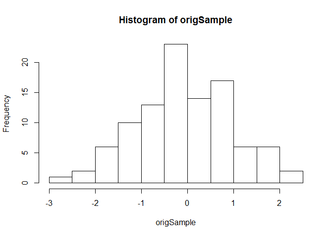<!-- -->

```r
#Start Iterarion process
nsim <- 1000
meanArray <- numeric(nsim)
medianArray <- numeric(nsim)

for (i in 1:nsim) {
  bootsample <- sample(origSample, size = 100, replace = TRUE)
  meanArray[i] <- mean(bootsample)
  medianArray[i] <- median(bootsample)
}

#Plot histogram of array of means after process
hist(meanArray)

#Plot lines with significant quantities Original Mean, New Mean, Quantiles
abline(v=origMean,col="red", lwd=2)
abline(v=mean(meanArray),col="blue", lty=3, lwd=2)
meanQuant <- quantile(meanArray, c(0.025, 0.975))
abline(v=meanQuant[1],col="green")
abline(v=meanQuant[2],col="green")
```

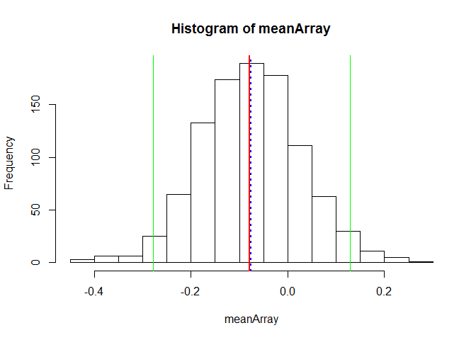<!-- -->

```r
#Plot histogram of array of medians after process
hist(medianArray)

#Plot lines with significant quantities Original Mean, New Mean, Quantiles
abline(v=origMedian,col="red", lwd=2)
abline(v=median(medianArray),col="blue", lty=3, lwd=2)
meanQuant <- quantile(medianArray, c(0.025, 0.975))
abline(v=meanQuant[1],col="green")
abline(v=meanQuant[2],col="green")
```

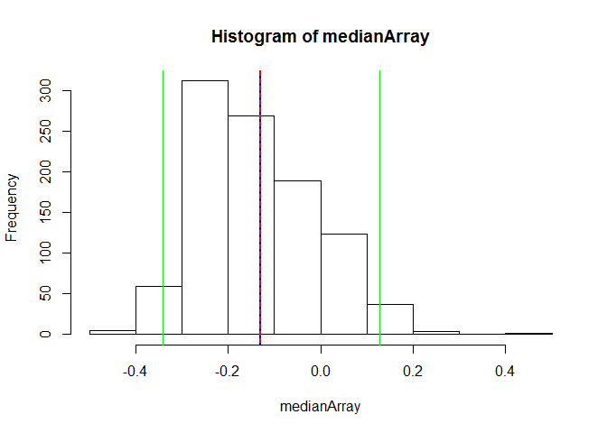<!-- -->

```r
#Show Original statistics
origMean
```

```
## [1] -0.07845831
```

```r
origMedian
```

```
## [1] -0.1303554
```

```r
origSD
```

```
## [1] 1.022413
```

```r
origVar
```

```
## [1] 1.045328
```

```r
#Show New statistics
mean(meanArray)
```

```
## [1] -0.07565411
```

```r
median(medianArray)
```

```
## [1] -0.1303554
```

```r
sd(medianArray)
```

```
## [1] 0.1277798
```

```r
var(medianArray)
```

```
## [1] 0.01632767
```

```r
# Show boxplots side by side
lmts <- range(origSample, meanArray)
par(mfrow = c(1, 2))
boxplot(origSample, ylim=lmts, xlab="Original Sample")
boxplot(meanArray, ylim=lmts, xlab="After bootsrap process")
```

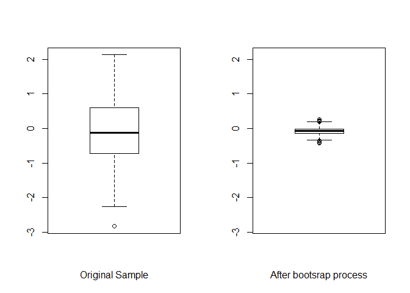<!-- -->

# Example 02: Starting from a normal distribution with a sample size 10

```r
#Original Sample
origSample <- rnorm(10, 0, 1)

#Show summary of original sampple
summary(origSample)
```

```
##    Min. 1st Qu.  Median    Mean 3rd Qu.    Max. 
## -1.2660 -0.8112 -0.7222 -0.4818 -0.3759  1.1930
```

```r
#Store measurements from original sample
origMean <- mean(origSample)
origMedian <- median(origSample)
origSD <- sd(origSample)
origVar <- var(origSample)

#Plot a histogram of Original Sample
hist(origSample)
```

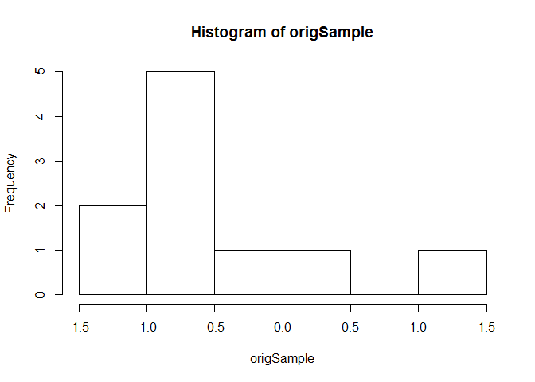<!-- -->

```r
#Start Iterarion process
nsim <- 1000
meanArray <- numeric(nsim)
medianArray <- numeric(nsim)

for (i in 1:nsim) {
  bootsample <- sample(origSample, size = 10, replace = TRUE)
  meanArray[i] <- mean(bootsample)
  medianArray[i] <- median(bootsample)
}

#Plot histogram of array of means after process
hist(meanArray)

#Plot lines with significant quantities Original Mean, New Mean, Quantiles
abline(v=origMean,col="red", lwd=2)
abline(v=mean(meanArray),col="blue", lty=3, lwd=2)
meanQuant <- quantile(meanArray, c(0.025, 0.975))
abline(v=meanQuant[1],col="green")
abline(v=meanQuant[2],col="green")
```

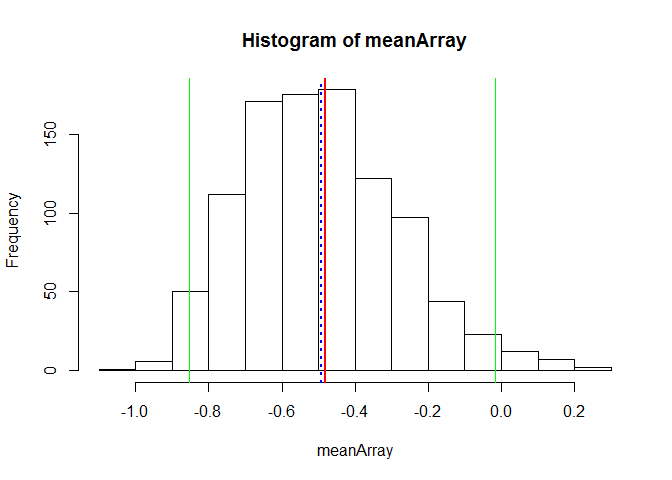<!-- -->

```r
#Plot histogram of array of medians after process
hist(medianArray)

#Plot lines with significant quantities Original Mean, New Mean, Quantiles
abline(v=origMedian,col="red", lwd=2)
abline(v=median(medianArray),col="blue", lty=3, lwd=2)
meanQuant <- quantile(medianArray, c(0.025, 0.975))
abline(v=meanQuant[1],col="green")
abline(v=meanQuant[2],col="green")
```

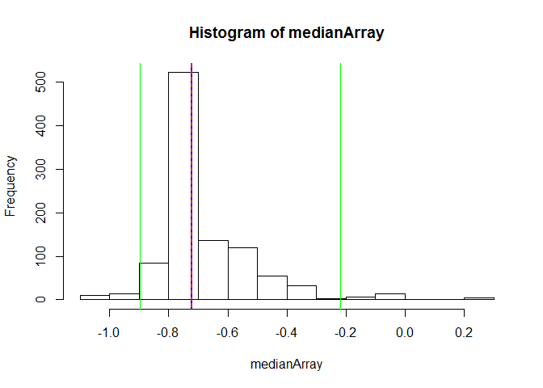<!-- -->

```r
#Show Original statistics
origMean
```

```
## [1] -0.4818326
```

```r
origMedian
```

```
## [1] -0.7221664
```

```r
origSD
```

```
## [1] 0.7218834
```

```r
origVar
```

```
## [1] 0.5211156
```

```r
#Show New statistics
mean(meanArray)
```

```
## [1] -0.4912433
```

```r
median(medianArray)
```

```
## [1] -0.7221664
```

```r
sd(medianArray)
```

```
## [1] 0.1687511
```

```r
var(medianArray)
```

```
## [1] 0.02847695
```

```r
# Show boxplots side by side
lmts <- range(origSample, meanArray)
par(mfrow = c(1, 2))
boxplot(origSample, ylim=lmts, xlab="Original Sample")
boxplot(meanArray, ylim=lmts, xlab="After bootsrap process")
```

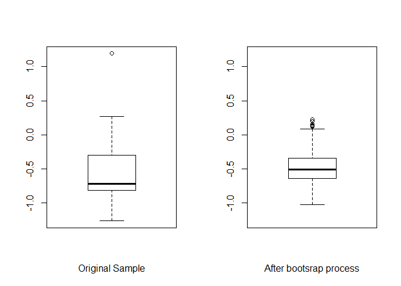<!-- -->

# Example 03: Starting from a normal distribution with a sample size 50

```r
#Original Sample
origSample <- rexp(50)

#Show summary of original sampple
summary(origSample)
```

```
##     Min.  1st Qu.   Median     Mean  3rd Qu.     Max. 
## 0.006322 0.408600 0.788100 1.115000 1.541000 5.428000
```

```r
#Store measurements from original sample
origMean <- mean(origSample)
origMedian <- median(origSample)
origSD <- sd(origSample)
origVar <- var(origSample)

#Plot a histogram of Original Sample
hist(origSample)
```

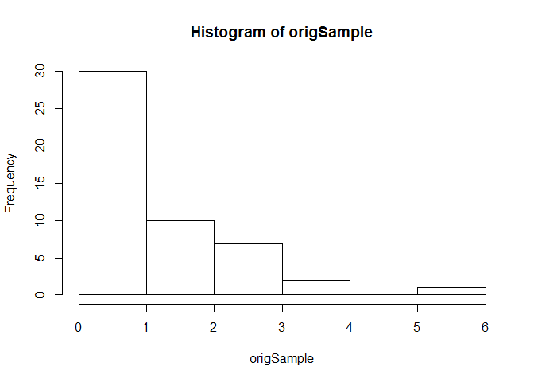<!-- -->

```r
#Start Iterarion process
nsim <- 1000
meanArray <- numeric(nsim)
medianArray <- numeric(nsim)

for (i in 1:nsim) {
  bootsample <- sample(origSample, size = 50, replace = TRUE)
  meanArray[i] <- mean(bootsample)
  medianArray[i] <- median(bootsample)
}

#Plot histogram of array of means after process
hist(meanArray)

#Plot lines with significant quantities Original Mean, New Mean, Quantiles
abline(v=origMean,col="red", lwd=2)
abline(v=mean(meanArray),col="blue", lty=3, lwd=2)
meanQuant <- quantile(meanArray, c(0.025, 0.975))
abline(v=meanQuant[1],col="green")
abline(v=meanQuant[2],col="green")
```

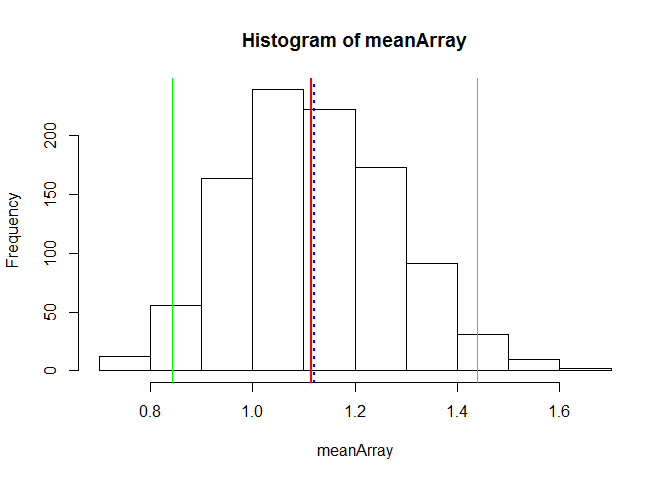<!-- -->

```r
#Plot histogram of array of medians after process
hist(medianArray)

#Plot lines with significant quantities Original Mean, New Mean, Quantiles
abline(v=origMedian,col="red", lwd=2)
abline(v=median(medianArray),col="blue", lty=3, lwd=2)
meanQuant <- quantile(medianArray, c(0.025, 0.975))
abline(v=meanQuant[1],col="green")
abline(v=meanQuant[2],col="green")
```

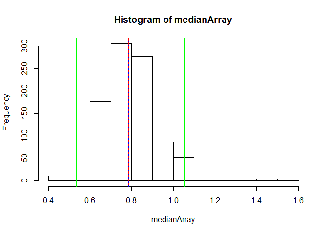<!-- -->

```r
#Show Original statistics
origMean
```

```
## [1] 1.115135
```

```r
origMedian
```

```
## [1] 0.7881019
```

```r
origSD
```

```
## [1] 1.08523
```

```r
origVar
```

```
## [1] 1.177725
```

```r
#Show New statisticsmean(meanArray)
median(medianArray)
```

```
## [1] 0.7884296
```

```r
sd(medianArray)
```

```
## [1] 0.1412785
```

```r
var(medianArray)
```

```
## [1] 0.01995961
```

```r
# Show boxplots side by side
lmts <- range(origSample, meanArray)
par(mfrow = c(1, 2))
boxplot(origSample, ylim=lmts, xlab="Original Sample")
boxplot(meanArray, ylim=lmts, xlab="After bootsrap process")
```

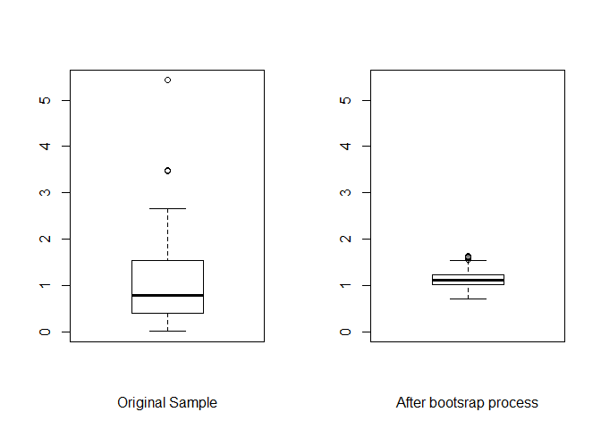<!-- -->

# Example 04: Starting from a normal distribution with a sample size 10 

```r
#Original Sample
origSample <- rexp(10)

#Show summary of original sampple
summary(origSample)
```

```
##    Min. 1st Qu.  Median    Mean 3rd Qu.    Max. 
##  0.2665  0.7346  0.9374  1.6200  2.1560  4.8790
```

```r
#Store measurements from original sample
origMean <- mean(origSample)
origMedian <- median(origSample)
origSD <- sd(origSample)
origVar <- var(origSample)

#Plot a histogram of Original Sample
hist(origSample)
```

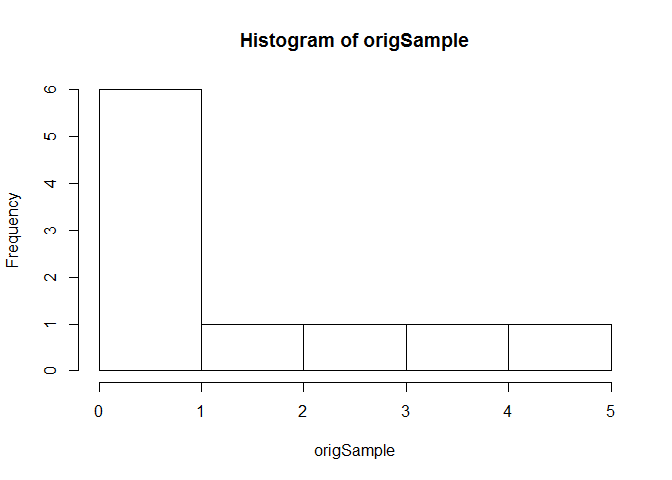<!-- -->

```r
#Start Iterarion process
nsim <- 1000
meanArray <- numeric(nsim)
medianArray <- numeric(nsim)

for (i in 1:nsim) {
  bootsample <- sample(origSample, size = 10, replace = TRUE)
  meanArray[i] <- mean(bootsample)
  medianArray[i] <- median(bootsample)
}

#Plot histogram of array of means after process
hist(meanArray)

#Plot lines with significant quantities Original Mean, New Mean, Quantiles
abline(v=origMean,col="red", lwd=2)
abline(v=mean(meanArray),col="blue", lty=3, lwd=2)
meanQuant <- quantile(meanArray, c(0.025, 0.975))
abline(v=meanQuant[1],col="green")
abline(v=meanQuant[2],col="green")
```

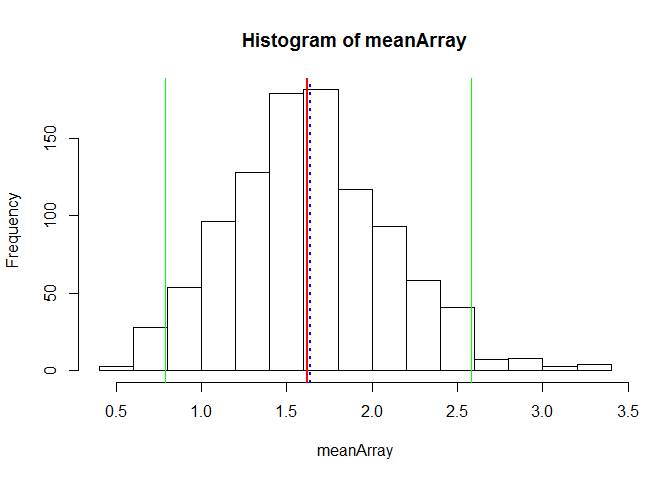<!-- -->

```r
#Plot histogram of array of means after process
hist(medianArray)

#Plot lines with significant quantities Original Mean, New Mean, Quantiles
abline(v=origMedian,col="red", lwd=2)
abline(v=median(medianArray),col="blue", lty=3, lwd=2)
meanQuant <- quantile(medianArray, c(0.025, 0.975))
abline(v=meanQuant[1],col="green")
abline(v=meanQuant[2],col="green")
```

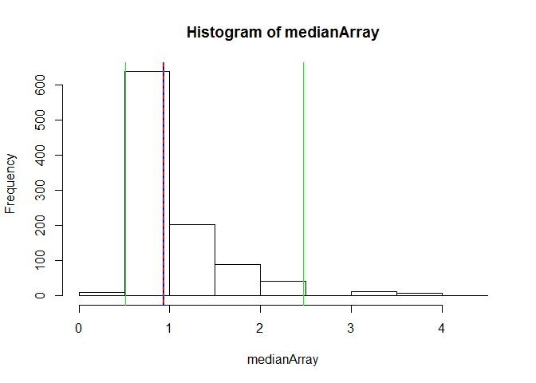<!-- -->

```r
#Show Original statistics
origMean
```

```
## [1] 1.620204
```

```r
origMedian
```

```
## [1] 0.937399
```

```r
origSD
```

```
## [1] 1.562787
```

```r
origVar
```

```
## [1] 2.442305
```

```r
#Show New statisticsmean(meanArray)
median(medianArray)
```

```
## [1] 0.937399
```

```r
sd(medianArray)
```

```
## [1] 0.5319308
```

```r
var(medianArray)
```

```
## [1] 0.2829503
```

```r
# Show boxplots side by side
lmts <- range(origSample, meanArray)
par(mfrow = c(1, 2))
boxplot(origSample, ylim=lmts, xlab="Original Sample")
boxplot(meanArray, ylim=lmts, xlab="After bootsrap process")
```

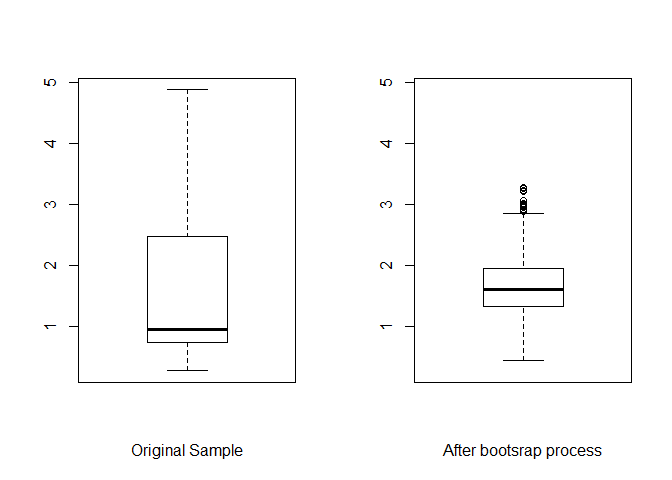<!-- -->

#Observations:

I've used two measures of center (*Mean and Median*) to graph the differences, knowing that the Central limit theorem involves the *mean* and not the *median*, and also that the bootstrapping process works well with statistics that involve the whole data set.

My intention was to observe graphically, the behavior of both measures of center, a resistant and a nonresistant one.

Examples 01 and 02 start from an already normal distributed sample and the last two from an exponential sample.


###After visual observation of the output of this code, I could identify several things:

* With more observations in a sample the likelihood of getting **larger observations** is higher, on both, normal distribution and exponential distribution.

* On examples starting from a normal distribution already, the spread gets tighter after the bootstrap process, it is still nearly normal but the variance and standard error become smaller.

* On examples 03 and 04 that start with an exponential distribution, after the bootstrap process the means of the samples show a nearly normal distribution.

* *Means* before and after the bootstrap process are very close to each other.

* *Medians* before and after seem to be the same every time I've ran this code.

* The bootstrapping process works well with *means* but not so well with *medians*, the distributions are not normal, which is expected as the ***Central Limit Theorem*** is based on the *mean*.


